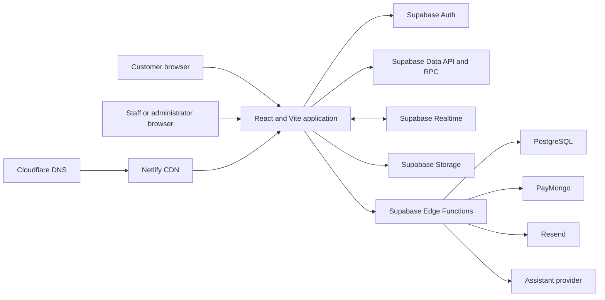

# Application architecture

CozyCraft uses a feature-oriented modular frontend backed by Supabase. Customer
and administrator experiences share domain models and the same protected data,
while authentication rules and route guards keep their access paths separate.

## System context



## Frontend module boundaries

| Module | Responsibility |
| --- | --- |
| `src/main.tsx` | Browser entry point and global stylesheet loading |
| `src/app/App.tsx` | Application startup, root state, realtime subscriptions, and route registration |
| `src/app/core/index.tsx` | Shared models, contexts, navigation layouts, formatters, and cross-feature helpers |
| `src/features/storefront/authentication/` | Customer sign-in, registration, recovery, and authentication callbacks |
| `src/features/storefront/catalog/` | Home, About, collections, search, discovery, and product details |
| `src/features/storefront/commerce/` | Cart, wishlist, checkout, payment return, and customer order flows |
| `src/features/storefront/account/` | Customer profile, addresses, security, preferences, support, and reviews |
| `src/features/admin/shell/` | Admin sign-in, authorization gate, navigation shell, and shared workspace controls |
| `src/features/admin/catalog/` | Products, categories, inventory, images, and product specifications |
| `src/features/admin/operations/` | Orders, payments, customers, reviews, support, reports, notifications, and activity logs |
| `src/features/admin/loyalty/` | Home Circle point balances, tier progress, and redemption monitoring |
| `src/features/admin/team-settings/` | Team roles, invitations, permissions, and store settings |
| `src/components/` | Reusable presentational primitives with no business ownership |
| `src/lib/` | Pure business rules grouped into admin, catalog, commerce, integration, settings, and shared areas |
| `src/services/` | External-system boundaries for Supabase and authentication |

## Dependency direction

The intended dependency direction is:

```text
routes and feature pages
        ↓
shared application context and domain libraries
        ↓
services and Supabase browser client
        ↓
RLS policies, RPC functions, storage, and Edge Functions
```

Shared components must not import an administrator or storefront feature.
Business rules that can be tested without React belong in `src/lib`. Calls to
Supabase Auth belong in `src/services/auth`; the single browser client is in
`src/services/supabase/client.ts`.

## Application communication

1. `App.tsx` restores the current Supabase session and initializes shared state.
2. Storefront and admin feature modules consume that state through the shared
   application context.
3. Reads and permitted writes use the Supabase client, protected RPC functions,
   or authenticated Edge Functions.
4. Realtime subscriptions invalidate or merge changing catalog, cart, wishlist,
   order, review, support, notification, and settings data.
5. PostgreSQL constraints, grants, and RLS remain the final authorization
   boundary; the interface is never treated as a security boundary.

## Route loading strategy

Large feature groups are dynamically imported from `App.tsx`. A customer does
not download the administration modules while browsing the storefront. Admin
pages load the catalog, operations, or settings module only when its routes are
opened. This reduces the initial bundle while keeping related workflows grouped
together.

## Backend boundaries

- `supabase/migrations/` is the source of truth for tables, indexes, constraints,
  functions, grants, RLS policies, storage rules, and realtime publications.
- `supabase/functions/` owns operations requiring provider secrets, service-role
  access, webhook verification, or privileged user management.
- `supabase/email-templates/` contains the customer-facing authentication email
  markup maintained with the project.
- `SECURITY.md` documents the authorization model and secret-handling rules.

## Deployment topology

Vite produces versioned static assets in `dist`. Netlify publishes that output,
applies the SPA route rewrite and security headers from `netlify.toml`, and
Cloudflare directs the production domain to Netlify. Supabase is deployed as a
separate backend release so schema migrations precede code that depends on
them.
