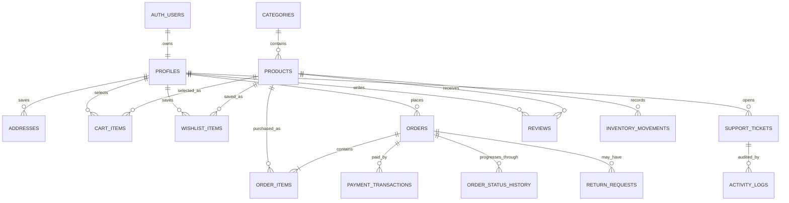

# Database design

Supabase Postgres is the system of record for the storefront, admin workspace,
and mobile application. The files in `supabase/migrations` are the authoritative
schema history; this document provides a readable domain map rather than a
replacement for those migrations.

## Core relationship map

`AUTH_USERS` represents Supabase Auth's managed `auth.users` table. The public
`profiles` record stores application fields and role information linked to the
same user identifier.

## Domain groups

| Domain | Main tables | Purpose |
| --- | --- | --- |
| Identity | `profiles`, `addresses`, `customer_preferences`, `admin_security_settings`, `mobile_push_tokens` | Customer details, delivery data, communication preferences, roles, and security settings |
| Catalog | `categories`, `products`, `product_views`, `inventory_movements` | Published product discovery, specifications, recently viewed items, and stock history |
| Shopping | `cart_items`, `wishlist_items` | Per-customer saved selections synchronized across devices |
| Orders | `orders`, `order_items`, `order_status_history`, `return_requests` | Checkout snapshots, fulfillment history, cancellation, returns, and refunds |
| Payments | `payment_transactions` | PayMongo session and settlement references; secrets are never stored in browser-readable fields |
| Engagement | `reviews`, `support_tickets`, `customer_notifications` | Verified-purchase reviews, support conversations, and customer updates |
| Administration | `activity_logs`, `admin_notifications`, `admin_notification_reads`, `store_settings`, `client_error_events` | Audit history, operational alerts, runtime settings, and client error monitoring |
| Loyalty | `mobile_loyalty_accounts`, `mobile_loyalty_transactions`, `mobile_loyalty_redemptions` | Mobile rewards balance, earning, and redemption history |

## Data ownership and authorization

- Customer-owned rows use the authenticated Supabase user ID as their ownership
  key.
- Public catalog access is limited to active products, categories, approved
  reviews, and explicitly public store settings.
- Staff permissions are determined by protected role checks and are narrower
  than super administrator permissions.
- RLS and explicit grants protect exposed tables. The interface hiding a button
  is not considered authorization.
- Privileged payment settlement, refunds, invitations, and user administration
  run through server-side functions.
- Product images are public catalog content. Avatars, return evidence, and
  support attachments use private storage policies.

See `SECURITY.md` for the complete security posture.

## Realtime data

Realtime publications and subscriptions cover records that benefit from
cross-device updates, including cart items, wishlists, orders, order status,
reviews, support, notifications, inventory, products, and store settings.
Subscriptions are scoped by ownership or operational role and should trigger a
targeted refresh rather than repeatedly downloading unrelated tables.

## Migration rules

1. Never edit a migration that has already reached the shared project.
2. Add a new timestamped migration for every schema, policy, RPC, or data repair
   change.
3. Make safe migrations idempotent when practical using `if exists`,
   `if not exists`, or guarded procedural blocks.
4. Add indexes for foreign keys and frequent ownership, status, and date filters.
5. Test RLS as anonymous, authenticated customer, staff, administrator, and
   service-role contexts when permissions change.
6. Deploy the schema before frontend or function code that depends on it.
